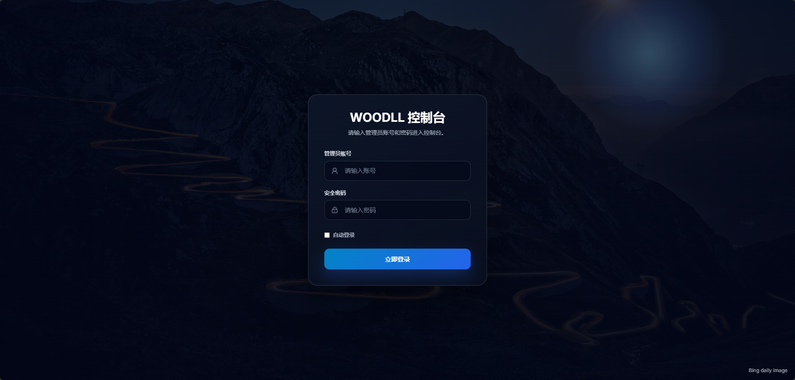
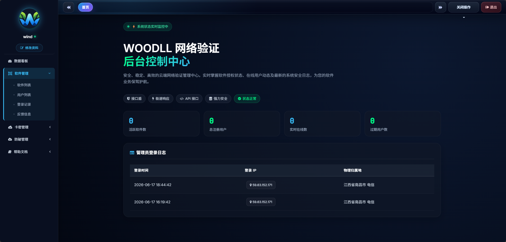

# WOODLL App

WOODLL App 是基于 ThinkPHP 8 的授权管理与后台控制台系统，包含安装向导、后台登录、控制台首页、用户登录、卡密与业务配置等功能。

## 界面预览

### 登录页



### 后台控制中心



## 运行环境

- PHP 8.0+
- MySQL 5.7+ / 8.0+
- Nginx / Apache
- Composer 依赖已随安装包保留

## 安装说明

1. 上传项目到网站目录。
2. 网站运行目录设置为 `public`。
3. Nginx 伪静态设置为 `ThinkPHP`。
4. 首次访问站点会自动跳转到 `/install/index.php`。
5. 按安装向导填写数据库信息并完成安装。

安装完成后，系统会写入 `.env` 和 `config/database.php`，并生成 `public/install/install.lock` 防止重复安装。

## Nginx 伪静态

宝塔面板可直接在网站设置中把伪静态选择为 `ThinkPHP`。也可以参考项目内的 `nginx-thinkphp-rewrite.txt`：

```nginx
location / {
    if (!-e $request_filename) {
        rewrite ^(.*)$ /index.php?s=$1 last;
        break;
    }
}
```

## 目录说明

- `public/`：网站运行目录。
- `public/install/`：安装向导。
- `config/database.php`：数据库连接配置。
- `.env.example`：环境变量示例。
- `nginx-thinkphp-rewrite.txt`：Nginx ThinkPHP 伪静态参考。

## 单文件安装包

发布包文件：`woodllapp-install.zip`
